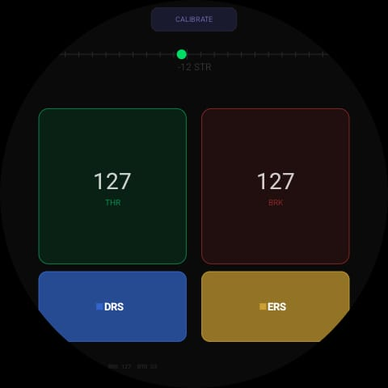

# WatchWheel

A Wear OS racing wheel controller that turns your smartwatch into a gyro-steered gamepad. Forked from [ginkage/wearmouse](https://github.com/ginkage/wearmouse).

> **Note:** This is not an officially supported Google product. This fork adds a gamepad (racing wheel) mode alongside the original WearMouse functionality — air mouse, cursor keys, and keyboard modes are all still available.

## Installation

The easiest way to install WatchWheel is to download the pre-compiled APK directly from the Releases page.

1. Go to the [Latest Release](https://github.com/virsut007/watchwheel/releases/latest) page.
2. Download the `app-universal-debug.apk` file attached at the bottom of the release notes.
3. Sideload the APK onto your Wear OS watch using ADB.

## Screenshots



## What It Does

WatchWheel pairs with any Bluetooth-capable device (PC, phone, Android TV) and appears as a standard USB/HID gamepad with:

- **Steering** — gyroscope-driven (wrist twist), mapped linearly to -127..+127
- **Throttle** — momentary touch zone (left side of screen)
- **Brake** — momentary touch zone (right side of screen)
- **DRS / ERS** — toggle buttons (bottom of screen)
- **Calibrate** — tap to re-center steering

Designed for racing games — tested with F1 games (Monoposto) on Mobile via Bluetooth.


## Tech Stack

| Layer | Technology |
|-------|------------|
| Language | Java 17 |
| Platform | Wear OS (Android P / API 28+) |
| Build System | Gradle + CMake (for native C++) |
| Bluetooth | Android Bluetooth HID Device API (`BluetoothHidDevice`) |
| Sensors | Android SensorManager (`TYPE_GYROSCOPE`) |
| UI | Custom `View` with Canvas 2D drawing (no XML layouts for racing screen) |
| Native | C++ orientation tracker via JNI (Google Cardboard SDK) |
| Libraries | Wearable Support (`2.9.0`), AndroidX Wear, Guava, ConstraintLayout, SplashScreen |
| Min SDK | 34 |
| Target SDK | 34 |


## Changes from Upstream (ginkage/wearmouse)

### HID Descriptor (extended)

A new gamepad report was **added** to the existing keyboard + mouse HID descriptor:
- **Steering axis** (X) — signed int8 (-127 to +127)
- **Gas axis** (Z) — unsigned int8 (0 to 127)
- **Brake axis** (Rz) — unsigned int8 (0 to 127)
- **8 buttons** — bitmask (bit 0 = DRS, bit 1 = ERS, bits 2-7 spare)
- SDP record renamed to "WatchWheel / Racing Wheel Controller"
- Subclass changed from `SUBCLASS1_COMBO` to `SUBCLASS1_NONE`

### New Files

| File | Description |
|------|-------------|
| `GamepadReport.java` | Builds the 4-byte HID input report for the gamepad descriptor |
| `SteeringManager.java` | Reads TYPE_GYROSCOPE, integrates Z-axis angular velocity into a steering value |
| `RacingActivity.java` | Main controller Activity — wires touch input + gyro steering + Bluetooth HID |
| `RacingView.java` | Custom View — multitouch racing controls for round Wear OS screens |

### Modified Files

| File | What Changed |
|------|-------------|
| `Constants.java` | Added `ID_GAMEPAD = 3`, replaced keyboard/mouse descriptor with gamepad descriptor, updated SDP name/description/provider |
| `HidDeviceApp.java` | Added `GamepadReport` instance, `sendGamepad()`, `getGamepadReport()`, and `ID_GAMEPAD` case in `getReport()` |
| `HidDataSender.java` | Added public `sendGamepad()` and `getGamepadReport()` methods |
| `ModeSelectFragment.java` | Added "Racing Wheel" preference click handler that launches `RacingActivity` |
| `prefs_mode_select.xml` | Added `pref_inputRacing` preference entry |
| `styles.xml` | Added `Theme.Racing` (no action bar, swipe-to-dismiss disabled) |
| `AndroidManifest.xml` | Registered `RacingActivity` with portrait orientation and racing theme |

## Architecture

```
RacingActivity
├── SteeringManager (gyro → steering value)
│   └── SensorManager (TYPE_GYROSCOPE, Z-axis only)
├── RacingView (touch → gas/brake/DRS/ERS)
│   └── Multitouch handling with pointer tracking
└── HidDataSender
    ├── GamepadReport (builds 4-byte report)
    └── HidDeviceApp → BluetoothHidDevice.sendReport()
```

## Compatibility

- **Watch:** Wear OS devices running Android P (API 28) and above
- **Host:** Any Bluetooth-capable device (Windows, Linux, macOS, Chrome OS, Android TV)
- No additional software needed on the host — standard HID gamepad

## How to Build

```bash
# Requires JDK 17+ (Android Studio's bundled JDK 21 works)
export JAVA_HOME="/path/to/Android Studio.app/Contents/jbr/Contents/Home"
./gradlew assembleDebug
```

The APK will be at `app/build/outputs/apk/debug/app-debug.apk`.

## How to Use

1. Install the APK on your Wear OS watch
2. Launch WatchWheel → pair with your PC/phone
3. Select **Racing Wheel** from the input mode menu
4. Twist your wrist to steer, touch left/right zones for gas/brake
5. Tap **CALIBRATE** at the top to re-center steering at any time

> **Important:** If you previously paired as a mouse (using the original WearMouse), you must unpair and re-pair — the HID descriptor is cached at pairing time.

## Credits

- Original [WearMouse](https://github.com/ginkage/wearmouse) by [ginkage](https://github.com/ginkage)
- Racing wheel modifications by [Viren Suthar](https://github.com/virsut007)

## License

```
Copyright 2018 Google LLC
Copyright 2024 WatchWheel Contributors

Licensed under the Apache License, Version 2.0
```

See [LICENSE](LICENSE) for the full text.
